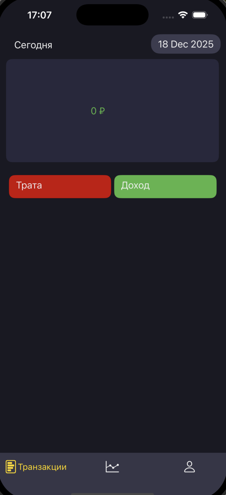
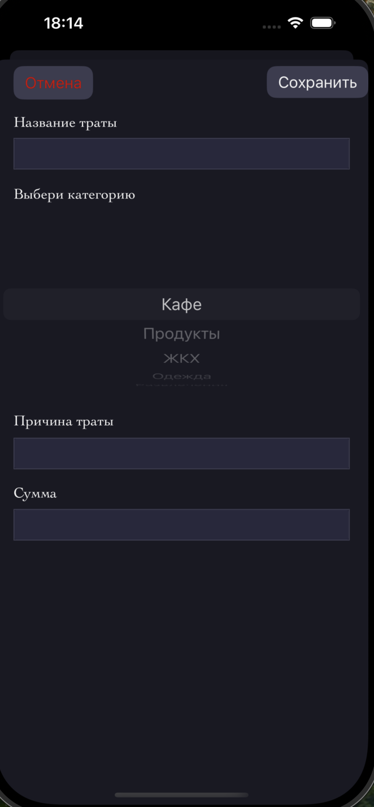
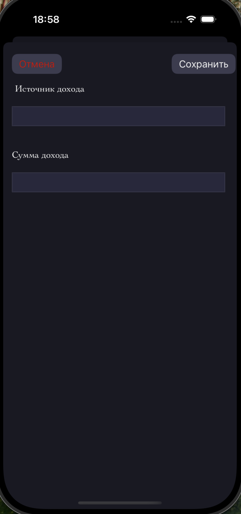
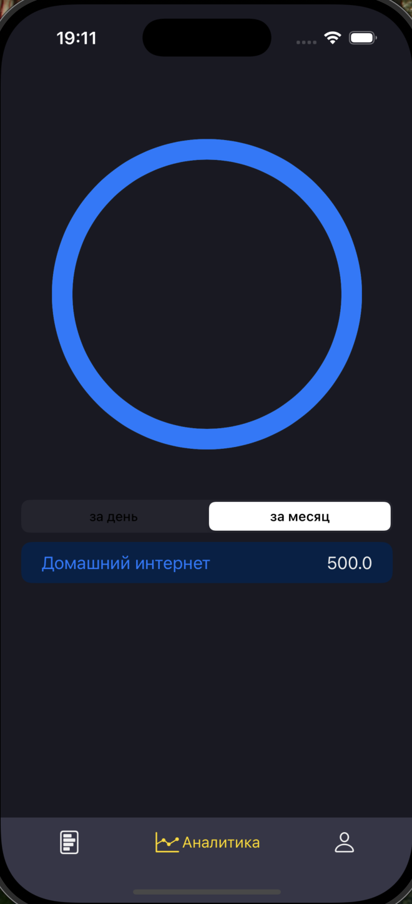
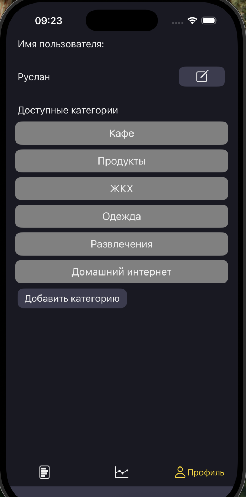
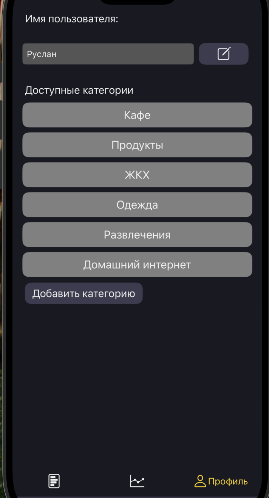
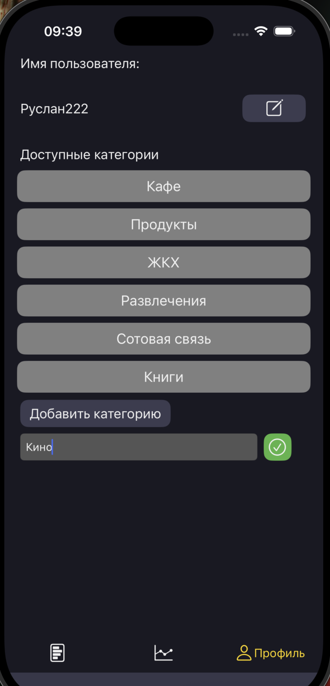

#Данный проект реализован на фреймворках UIKit, Foundation и CoreData

Проект реализован в тёмных тонах в стиле минимализма, без броских цветов и лишних деталей.  
Основная идея: записывать все расходы и доходы и отслеживать динамику в течении месяца.  
Данный проект реализован в архитектуре MVVM `(Model, View, View-Model)`.  
  
Основные взаимодействия с главным экраном:  
1. Добавить трату. 
2. Добавить доход.  
3. Перейти в окно аналитики.
4. Перейти в окно профиля.  
  
- Нажав кнопку `Трата` открывается диалоговое окно.  

1. Есть поля ввода: название, причина и сумма трат, есть проверку на пустоту строки, без заполнении каждой строки, трата не сохраняется.  
2. Выбор категории трат реализован через PickerView c динамическим подгружение данных изи сущности `CategoriesEntity`
3. Кнопка отмены и сохранении данных в сущность `TransactionEntity`.  
  
- Нажав кнопку `Доход` в основном экране открывается диалоговое окно.  

1. Есть поля ввода: название дохода и сумма дохода, аналогично предыдущей странице есть проверка ввода
3. Кнопка отмены и сохранении данных в сущность `TransactionEntity`.  

- Нажав на иконку  
  
Переходим в новое окно.  
   
В данном окне мы можем смотреть динамику расходов и доходов за месяц и дни.  
Траты реализованы в виде круга, где заполнение цвета круга зависит от отношению `общие расходы / расходы по категории`
  
- Нажав на иконку  
   
Переходим в новое окно.  
  
В данном окне, мы можкм добавлять новые или удалять существуещие  категории.  
1.Нажав на иконку правки, UILabel переходит в UITextField c сохранением текста из UILabel.  
  
2.Нажав на ту же иконку мы сохраняем имя профиля в UserDefault.  
3.Доступные категории реализованы через комбинацию UIScrollView и UIStackView.  
3.Выбрав одну из категорий появляется кнопка удалить, которая стирает данную категорию из базы данных.  
3.Кнопка `Добавить категорию` открывает UITextField и кнопку сохранения, которая ранее были скрыты.   
 

